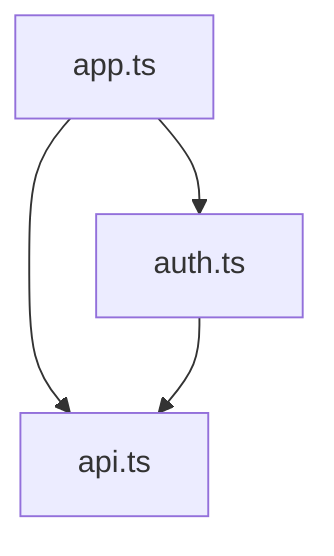

# Analyze Skill

Code analysis for quality, complexity, and patterns.

## When to Use
- Assessing code quality
- Finding technical debt
- Pre-refactoring analysis
- Architecture review
- Onboarding documentation

## Analysis Types

### Complexity Analysis
```
Metrics:
- Cyclomatic complexity
- Cognitive complexity
- Lines of code
- Function length
- Nesting depth
```

### Dependency Analysis
```
Examine:
- Import graph
- Circular dependencies
- Unused dependencies
- Outdated packages
- Bundle impact
```

### Pattern Analysis
```
Identify:
- Design patterns used
- Anti-patterns present
- Code smells
- Duplication
- Inconsistencies
```

### Quality Analysis
```
Check:
- Test coverage
- Documentation coverage
- Type coverage
- Error handling
- Logging practices
```

## Output Format

```markdown
## Code Analysis: {scope}

### Summary
- Files analyzed: {n}
- Total lines: {n}
- Average complexity: {n}

### Complexity Hotspots
| File | Function | Complexity | Recommendation |
|------|----------|------------|----------------|
| auth.ts | validateUser | 15 | Split into smaller functions |
| api.ts | handleRequest | 12 | Extract error handling |

### Dependency Graph


### Code Smells
1. **Long Method** - `processOrder()` is 200 lines
2. **Feature Envy** - `UserService` accesses `Order` internals
3. **Duplicate Code** - Error handling repeated in 5 files

### Technical Debt
| Issue | Severity | Effort | Priority |
|-------|----------|--------|----------|
| No input validation | High | Medium | 1 |
| Missing error handling | Medium | Low | 2 |
| Outdated dependencies | Low | Low | 3 |

### Recommendations
1. {prioritized recommendation}
2. {prioritized recommendation}
```

## Usage

```
analyze: assess the quality of the auth module

analyze: find technical debt in the API layer

analyze: review the architecture of the frontend
```
